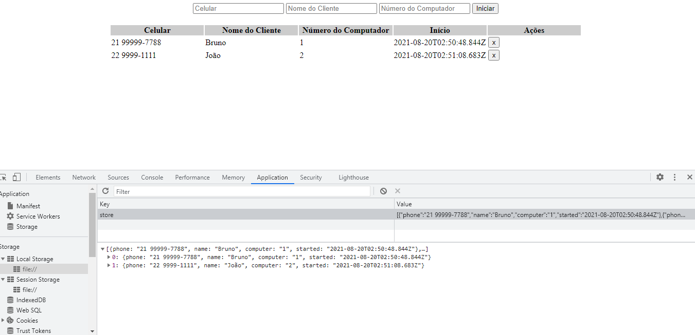

# TypeScript Practise - Lan House



- Instrutor: Andre Soares
- Plataforma de Ensino: https://digitalinnovation.one/sign-up?ref=K5EF2VCVKA
- Lab: Aprenda a criar um sistema de estacionamento usando TypeScript

<hr>

## Vídeo Explicativo

[Youtube](https://youtu.be/-7PevpyySaw)

<hr>

##  Objetivo

- Utilizar o superset TypeScript Lan House. Aplicação destinada a minha prática dos meus primeiros passos com TypeScript com objetivo de gerenciar a utilização dos computadores de uma Lan House.

<hr>

## Tecnologias Utilizadas

- TypeScript
- HTML
- CSS
- Visual Studio Code (opcional)

<hr>


## Executar aplicação completa

- Gerar novo arquivo .ts do TypeScript. Abra a o terminal na pasta do projeto e digite:

```
npx -p typescript tsc --init
```

- Para transpilar o arquivo para .js do JavaScript use o comando:

```
npx -p typescript tsc
```

Abra o arquivo index.html no seu navegador.

<hr>

## Autor

- Bruno Gamba Rocha
- https://www.linkedin.com/in/bruno-gamba-rocha/
